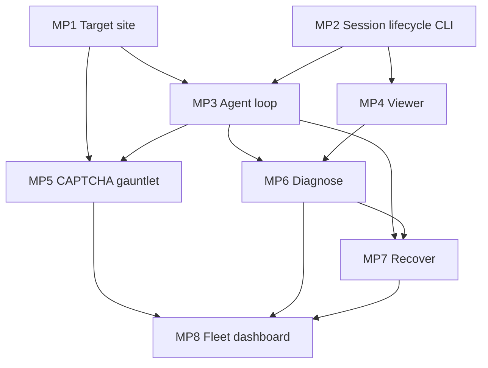

# feat: Reliability Arcade — Mini-Project Index

**Date:** 2026-06-18
**Type:** feat
**Depth:** Standard (index)
**Origin:** `docs/brainstorms/2026-06-18-steel-reliability-arcade-requirements.md`
**Master plan:** `docs/plans/2026-06-18-001-feat-steel-captcha-gauntlet-plan.md` (R1–R14)

---

## Summary

The CAPTCHA Gauntlet demo decomposes into **8 capability-cluster mini-projects**, each with its own
plan doc. This index sets the build order, the cross-project dependency graph, and the R-ID coverage map.
One cluster (MP2 — session lifecycle) is built **via a printingpress.dev-generated CLI** rather than raw
`steel-sdk` calls; the rest call Steel/Gemini directly from app code.

The mini-projects are **interdependent, not parallel-independent**: the target site, session lifecycle, and
agent loop are prerequisites that the diagnose / recover / fleet projects build on. Plan and execute in the
dependency order below.

---

## Problem Frame

The master plan (001) is one large Standard plan covering R1–R14. For execution, that single artifact is
hard to land as atomic commits and hard to parallelize across `ce-work` runs. Segmenting by capability
cluster gives each feature set a focused plan with its own implementation units, test scenarios, and
verification — while this index preserves the whole-system view and ordering that segmentation would
otherwise lose.

---

## Mini-Projects

| # | Plan doc | Cluster | Primary R-IDs | Depends on |
|---|----------|---------|---------------|------------|
| MP1 | `2026-06-18-003-feat-mp1-target-site-plan.md` | Target site (own broken-on-purpose game + failure modes a–e) | R2, R5, R11, R12 | — |
| MP2 | `2026-06-18-004-feat-mp2-session-lifecycle-cli-plan.md` | Steel session lifecycle **via printing-press CLI** | R4, R10 | — |
| MP3 | `2026-06-18-005-feat-mp3-agent-loop-plan.md` | Gemini agent observe→act loop | R4 | MP1, MP2 |
| MP4 | `2026-06-18-006-feat-mp4-viewer-plan.md` | Live `debugUrl` iframe + recorded `sessionViewerUrl` | R7 | MP2 |
| MP5 | `2026-06-18-007-feat-mp5-captcha-gauntlet-plan.md` | reCAPTCHA/Turnstile `solveCaptcha` + vision-grid climax | R5, R6, R13 | MP1, MP3 |
| MP6 | `2026-06-18-008-feat-mp6-diagnose-evidence-plan.md` | Diagnose-from-evidence (failure → why) | R8, R14 | MP3, MP4 |
| MP7 | `2026-06-18-009-feat-mp7-recover-plan.md` | Recover (in-session retry + session re-create stealth/proxy/mobile) | R8, R12 | MP3, MP6 |
| MP8 | `2026-06-18-010-feat-mp8-fleet-dashboard-plan.md` | Parallel fleet + variance dashboard | R9 | MP5, MP6, MP7 |

Cross-cutting R1 (one Netlify deploy), R3 (free tiers), R10 (secrets in env) are honored by every project;
the U1 scaffold in the master plan / existing `netlify/` already establishes the deploy shape.

---

## Dependency Graph

**Build order:** MP1 + MP2 (parallel, no deps) → MP3, MP4 → MP5, MP6 → MP7 → MP8.

---

## Key Technical Decisions

- **KTD1 — Segment by capability cluster, not demo beat.** Clusters map cleanly to code seams (target
  site, agent, viewer, etc.); beats cut across seams. Per-project test scenarios stay coherent.
- **KTD2 — MP2 lifecycle via printing-press CLI; agent drive stays in app.** The generated CLI owns
  create/list/get/release of Steel sessions. The Playwright-over-CDP agent drive (MP3) calls Steel directly
  — the CLI is not on the per-step hot path (Netlify-timeout sensitive; see master plan loop decision).
- **KTD3 — `useProxy` is verify-early, not a promised beat** (origin gotcha #1). MP7 plans `stealthConfig`
  alone as the verified-free recover path; `useProxy` is a verify-then-include-or-drop-to-verbal item.
- **KTD4 — Interdependent, ordered execution.** Projects ship in dependency order; MP8 cannot land before
  its three upstreams. `ce-work` should consume them in the order table above.

---

## Open Questions (carried to per-project docs)

- Netlify loop execution model (front-end-drives-loop vs background fn) — owned by MP3, affects MP6/MP7/MP8.
- Fleet size 3 vs 5 vs Steel concurrency cap (~5) + browser-hour budget — owned by MP8.
- Exact printing-press CLI command shapes + generated install path — owned by MP2, deferred to impl.
- Steel event/log SDK method names for evidence capture — owned by MP6, deferred to impl (verify in SDK).

---

## Scope Boundaries

**In:** the 8 clusters above; segmented plan docs; dependency ordering.

**Deferred to Follow-Up Work:** Steel Profiles persistent-login; `steel.scrape()` recon; building a
composable Steel Skill; stockpredictors tie-in.

**Out (identity / ethics):** automating any third-party site; self-hosted steel-browser Docker; any flow
needing a terminal at demo time or an always-on server beyond Netlify functions.
