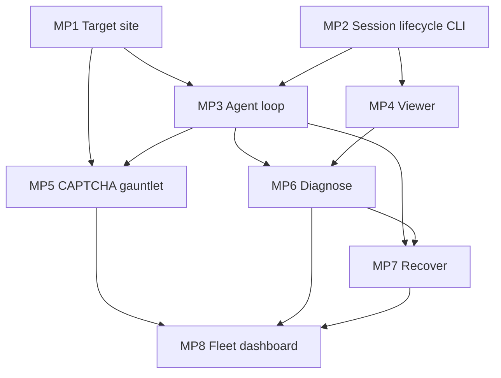

# feat: Reliability Arcade — Mini-Project Index

**Date:** 2026-06-18
**Type:** feat
**Depth:** Standard (index)
**Origin:** `docs/brainstorms/2026-06-18-steel-reliability-arcade-requirements.md`
**Master plan:** `docs/plans/2026-06-18-001-feat-steel-captcha-gauntlet-plan.md` (R1–R14)

---

## Summary

The CAPTCHA Gauntlet demo decomposes into **8 capability-cluster mini-projects**, each with its own
plan doc. This index sets the build order, the cross-project dependency graph, and the R-ID coverage map.
One cluster (MP2 — session lifecycle) is built **via a printingpress.dev-generated CLI** rather than raw
`steel-sdk` calls; the rest call Steel/Gemini directly from app code.

The mini-projects are **interdependent, not parallel-independent**: the target site, session lifecycle, and
agent loop are prerequisites that the diagnose / recover / fleet projects build on. Plan and execute in the
dependency order below.

---

## Problem Frame

The master plan (001) is one large Standard plan covering R1–R14. For execution, that single artifact is
hard to land as atomic commits and hard to parallelize across `ce-work` runs. Segmenting by capability
cluster gives each feature set a focused plan with its own implementation units, test scenarios, and
verification — while this index preserves the whole-system view and ordering that segmentation would
otherwise lose.

---

## ⚠️ Current State — the demo is ~80% already built

**Critical:** these mini-project docs were first drafted as if greenfield. They are **not** — most of the
demo is already implemented and committed. Read each per-project doc as a **gap-fill / harden / verify**
plan against existing code, not a build-from-zero plan. Verified working-tree state (git log + file read,
2026-06-18):

| Unit (master 001) | State | Where |
|---|---|---|
| U1 scaffold (netlify.toml, health fn, env) | **Done, committed** | `netlify/functions/health.js` |
| U2 gauntlet target pages | **Done, committed** | `public/gauntlet/*.html` (all 6 routes + images + `manifest.json`) |
| U3 Steel session lib + pre-warm | **Done, committed** | `netlify/functions/lib/steel.mjs`, `session-create.js` |
| U4 step engine (observe→decide→act) | **Done, committed** | `agent-step.js` (all 6 routes), `lib/{gemini,evidence,flows}.mjs` |
| U5 control UI + FE loop | **Done, committed** | `public/{index.html,app.js,styles.css}` |
| U6 diagnose + recover | **Done, committed** | in `agent-step.js` (hcaptcha delayed-render, vision re-classify) |
| U7 fleet variance dashboard | **Done, committed** | `fleet-run.js` |
| U8 bot-wall stealth relaunch + mobile-bug | **Done, committed** | `agent-step.js`, `steel.mjs` `relaunchWithStealth` |
| U9 self-explaining showcase (R14) **UI** | **NOT built** (in progress — uncommitted `app.js`/`index.html` edits) | backend data ready in `flows.mjs` (`apiSnippet`/`docsUrl`/`proves`) |
| MP2 lifecycle **via printing-press CLI** | **NOT built** — genuinely new; currently inline in `steel.mjs`/`session-create.js` | — |

**So the real remaining work is:** (1) **R14 showcase UI** — the one unbuilt feature, owned newly by **MP9**
below; (2) **MP2** — refactor the inline lifecycle into a printing-press-generated CLI (net-new); (3)
**verify + harden** the built pieces (see Verify checklist). Everything MP1/MP3/MP4/MP5/MP6/MP8 describe is
largely **already coded** — those docs are now harden/verify references, not build orders.

### Bugs / conflicts found during audit (fix before/while hardening)

- **Import extension mismatch (likely runtime break):** `agent-step.js` imports `./lib/steel.js`,
  `./lib/flows.js`, etc., but the files on disk are `.mjs`. Verify resolution under the Netlify runtime;
  fix imports or rename files.
- **`useProxy` hardwired on** (`steel.mjs` `relaunchWithStealth` → `createSession({stealth:true, useProxy:true})`)
  but origin **gotcha #1** says proxy may not be free-tier honest. **Verify free-tier `useProxy` works**; if
  not, drop it and recover with `stealthConfig` alone (MP7 KTD3).
- **Bot-wall honesty (gotcha #2):** code recovers by re-navigating with `?stealth=1` — confirm the wall page
  actually gates on a signal Steel changes, not just the query flag, or the beat is a no-op (MP1 U4 / MP7 KTD4).

### Verify checklist (the genuine open risks, all built-but-unverified)

- One agent step fits Netlify's **10s** sync cap (001 R-risk1 — the dominant constraint).
- `useProxy` free-tier honesty (gotcha #1).
- Vision-grid: confirm tiles are clicked **by DOM id** (`#tile-N`) per 001 KTD4 — **they are** in
  `agent-step.js:127`; `sessions.computer` coordinate clicking stays **Deferred**.
- Gemini free-tier rate limits under the parallel fleet (MP8).

---

## Mini-Projects

| # | Plan doc | Cluster | Primary R-IDs | Depends on |
|---|----------|---------|---------------|------------|
| MP1 | `2026-06-18-003-feat-mp1-target-site-plan.md` | Target site — instrument live **Math Arcade Wrecker** (`matharcardewrecker.netlify.app`) w/ failure modes a–e | R2, R5, R11, R12 | — |
| MP2 | `2026-06-18-004-feat-mp2-session-lifecycle-cli-plan.md` | Steel session lifecycle **via printing-press CLI** | R4, R10 | — |
| MP3 | `2026-06-18-005-feat-mp3-agent-loop-plan.md` | Gemini agent observe→act loop | R4 | MP1, MP2 |
| MP4 | `2026-06-18-006-feat-mp4-viewer-plan.md` | Live `debugUrl` iframe + recorded `sessionViewerUrl` | R7 | MP2 |
| MP5 | `2026-06-18-007-feat-mp5-captcha-gauntlet-plan.md` | reCAPTCHA/Turnstile `solveCaptcha` + vision-grid climax | R5, R6, R13 | MP1, MP3 |
| MP6 | `2026-06-18-008-feat-mp6-diagnose-evidence-plan.md` | Diagnose-from-evidence (failure → why) | R8, R14 | MP3, MP4 |
| MP7 | `2026-06-18-009-feat-mp7-recover-plan.md` | Recover (in-session retry + session re-create stealth/proxy/mobile) | R8, R12 | MP3, MP6 |
| MP8 | `2026-06-18-010-feat-mp8-fleet-dashboard-plan.md` | Parallel fleet + variance dashboard | R9 | MP5, MP6, MP7 |
| **MP9** | `2026-06-18-011-feat-mp9-showcase-plan.md` | **Self-explaining technical showcase UI (R14)** — the one unbuilt feature | R14 (R4/R13 surfaced) | MP4, MP5 |

Cross-cutting R1 (one Netlify deploy), R3 (free tiers), R10 (secrets in env) are honored by every project;
the U1 scaffold in the master plan / existing `netlify/` already establishes the deploy shape.

**R14 ownership correction:** R14 (self-explaining showcase) is owned by **MP9**, not MP6. MP6 only owns the
*diagnosis legibility* slice of R14; the header/architecture line + per-flow live API-snippet panel is MP9.
`flows.mjs` already carries the `apiSnippet`/`docsUrl`/`proves` data MP9's UI renders.

---

## Model-Tier Routing

Every implementation unit across the mini-projects carries a **model tier** marking the weakest model that
can execute it safely:

- **🟢 Less-capable (Haiku-class)** — mechanical, self-contained, exact verified paths, no design judgment.
  Safe to delegate down.
- **🟡 Capable (Sonnet-class)** — multi-file, must infer existing patterns, moderate decisions, integration
  wiring. The default for most units.
- **🔴 Highly-capable (Opus-class)** — design judgment, external probing/verification, deliberately
  under-specified, or high cost-of-getting-it-wrong. Do not delegate down.

**Per-mini-project dominant tier** (highest-tier unit it contains):

| MP | Dominant tier | Why |
|----|---------------|-----|
| MP1 Target site | 🔴 | Bot-wall honesty signal (gotcha #2) + plausible mobile bug (gotcha #3) are design judgment; static pages within it are 🟢/🟡 |
| MP2 Lifecycle CLI | 🔴 | Printing-press generator workflow is novel + deferred-to-impl; refactor-from-inline needs judgment |
| MP3 Agent loop | 🔴 | 10s-cap timing probe + loop-model decision (KTD1) is highly-capable; the lib units are 🟡 |
| MP4 Viewer | 🟡 | Iframe embed + replay seek; cross-origin framing fallback is a small judgment call |
| MP5 CAPTCHA gauntlet | 🟡 | Mostly built; hardening/verify. Vision path decided. Banner is 🟢 |
| MP6 Diagnose | 🟡 | Built; evidence-bundle + taxonomy prompt tuning is 🟡 |
| MP7 Recover | 🔴 | `useProxy` free-tier probe (gotcha #1) + honest-recover verification are highly-capable |
| MP8 Fleet dashboard | 🟡 | Built; fleet-size sizing vs limits (gotcha #4) is a 🟡 decision |
| MP9 Showcase UI | 🟡 | Net-new UI; data source exists; infer `app.js` patterns. U1 legend is 🟢 |

**Routing guidance:** delegate 🟢 units to Haiku freely; run 🟡 units on Sonnet; reserve 🔴 units for Opus
(or escalate via `opus-advisor` before a less-capable model attempts them). The 🔴 units cluster around the
four open risks in the Verify checklist — they are the genuine judgment work, not transcription.

---

## Dependency Graph

**Build order:** MP1 + MP2 (parallel, no deps) → MP3, MP4 → MP5, MP6 → MP7 → MP8.

---

## Key Technical Decisions

- **KTD1 — Segment by capability cluster, not demo beat.** Clusters map cleanly to code seams (target
  site, agent, viewer, etc.); beats cut across seams. Per-project test scenarios stay coherent.
- **KTD2 — MP2 lifecycle via printing-press CLI; agent drive stays in app.** The generated CLI owns
  create/list/get/release of Steel sessions. The Playwright-over-CDP agent drive (MP3) calls Steel directly
  — the CLI is not on the per-step hot path (Netlify-timeout sensitive; see master plan loop decision).
- **KTD3 — `useProxy` is verify-early, not a promised beat** (origin gotcha #1). MP7 plans `stealthConfig`
  alone as the verified-free recover path; `useProxy` is a verify-then-include-or-drop-to-verbal item.
- **KTD4 — Interdependent, ordered execution.** Projects ship in dependency order; MP8 cannot land before
  its three upstreams. `ce-work` should consume them in the order table above.

---

## Open Questions (carried to per-project docs)

- Netlify loop execution model (front-end-drives-loop vs background fn) — owned by MP3, affects MP6/MP7/MP8.
- Fleet size 3 vs 5 vs Steel concurrency cap (~5) + browser-hour budget — owned by MP8.
- Exact printing-press CLI command shapes + generated install path — owned by MP2, deferred to impl.
- Steel event/log SDK method names for evidence capture — owned by MP6, deferred to impl (verify in SDK).

---

## Scope Boundaries

**In:** the 8 clusters above; segmented plan docs; dependency ordering.

**Deferred to Follow-Up Work:** Steel Profiles persistent-login; `steel.scrape()` recon; building a
composable Steel Skill; stockpredictors tie-in.

**Out (identity / ethics):** automating any third-party site; self-hosted steel-browser Docker; any flow
needing a terminal at demo time or an always-on server beyond Netlify functions.
