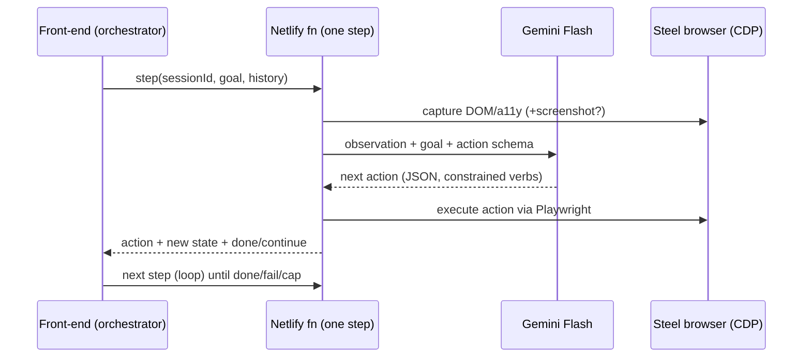

# feat: MP3 — Gemini Agent Observe→Act Loop

**Date:** 2026-06-18
**Type:** feat
**Depth:** Standard
**Origin:** `docs/brainstorms/2026-06-18-steel-reliability-arcade-requirements.md`
**Index:** `docs/plans/2026-06-18-002-feat-arcade-miniprojects-index-plan.md`
**R-IDs:** R4 · **Depends on:** MP1, MP2

---

## Summary

The agent brain: Gemini Flash (free tier) observes a page (DOM / accessibility tree, optionally a
screenshot) and chooses the next action toward a plain-English goal, driving a real Steel cloud browser via
Playwright-over-CDP. This is the per-step hot path — it calls Steel directly (not via the MP2 CLI) and must
fit Netlify's timeout window, so the loop architecture (front-end-drives-loop vs background fn) is decided
here.

---

## Problem Frame

A free LLM must drive a browser deterministically enough for a live demo, inside Netlify's ~10s sync /
~26s background function window, with Gemini free-tier rate limits. The action space must be constrained
(tight prompting) so the agent doesn't wander, and each step must be small enough to survive the timeout.

---

## Requirements

- **R4** — Gemini Flash + Playwright-over-CDP drives a real Steel cloud browser, server-side.

---

## Key Technical Decisions

- **KTD1 — Loop execution model (THE deferred origin question).** Default to **front-end-drives-loop**:
  one agent step per function call, browser-side orchestration, so each call stays under the sync window
  and the live viewer updates between steps. Alternative (single background fn) risks the ~26s cap on
  multi-step routes + the stealth/proxy relaunch (MP7). *Confirm at impl with a timing probe.*
- **KTD2 — Constrained action space.** Agent picks from a fixed verb set (navigate, click[selector],
  type[selector,text], waitFor[selector], screenshot, done, fail) returned as JSON — not free-form. Keeps
  Gemini deterministic enough for stage.
- **KTD3 — Observation = DOM/a11y first, screenshot optional.** DOM/a11y tree is the cheap primary signal;
  add screenshot only where vision strengthens a step (MP6 diagnose / MP5 vision-grid).

## High-Level Technical Design

---

## Implementation Units

### U1. Observation capture
- **Model tier:** 🟡 Capable — Playwright DOM/a11y extraction; largely built inside `agent-step.js`. Verify/extract.
- **Goal:** Turn current page state into a compact observation for Gemini.
- **Requirements:** R4
- **Dependencies:** MP2 (wsEndpoint), MP1 (a page to observe)
- **Files:** `netlify/functions/lib/observe.js`, `netlify/functions/lib/observe.test.js`
- **Approach:** Connect Playwright to Steel `browserWSEndpoint`; extract DOM/a11y tree + visible
  interactive elements (selector + role + text); optional screenshot buffer.
- **Test scenarios:**
  - Happy: returns interactive elements with selectors for a known arcade page.
  - Edge: empty/blank page → empty element list, no throw.
  - Edge: screenshot flag toggles buffer presence.
- **Verification:** observing an arcade level lists its real controls.

### U2. Action schema + Gemini step
- **Model tier:** 🟡 Capable — constrained-action prompt design + parse/validate; `gemini.mjs` exists as a base.
- **Goal:** Ask Gemini for the next action given observation + goal; parse to a typed action.
- **Requirements:** R4
- **Dependencies:** U1
- **Files:** `netlify/functions/lib/agent-step.js`, `netlify/functions/lib/agent-step.test.js`
- **Approach:** Prompt with goal + observation + constrained action JSON schema. Parse/validate response to
  one verb. Reject malformed → bounded reprompt.
- **Test scenarios:**
  - Happy: a goal+observation yields a valid action of the allowed verb set.
  - Error: malformed model output → validation error + one bounded retry, then `fail`.
  - Edge: model returns `done` when goal element present.
  - `Covers: R4 autonomy.`
- **Verification:** mocked-Gemini tests parse each verb; live smoke advances one real step.

### U3. Action executor
- **Model tier:** 🟢 Less-capable — map each verb to a Playwright call; mechanical once schema fixed. (Built per-route in `agent-step.js`.)
- **Goal:** Execute a typed action against the Steel browser.
- **Requirements:** R4
- **Dependencies:** U2
- **Files:** `netlify/functions/lib/act.js`, `netlify/functions/lib/act.test.js`
- **Approach:** Map each verb to a Playwright call; capture pre/post state for history + evidence (feeds MP6).
- **Test scenarios:**
  - Happy: `click[selector]` on a present element advances the page.
  - Error: action on a missing selector → typed actionable failure (feeds diagnose).
  - Edge: `waitFor` honors timeout (drives mode-(a) flaky recovery).
  - Integration: navigate→click→done reaches `#level-complete` on a clean level.
- **Verification:** the loop drives a clean arcade level to win end-to-end.

### U4. Loop orchestrator + step endpoint
- **Model tier:** 🔴 Highly-capable — the loop-execution-model decision (KTD1) + 10s-cap timing probe (001 R-risk1, the dominant constraint) is judgment, not transcription.
- **Goal:** One-step-per-call endpoint the front-end drives.
- **Requirements:** R4
- **Dependencies:** U1, U2, U3
- **Files:** `netlify/functions/agent-step.js` (HTTP), `public/arcade/run.js` (FE orchestrator)
- **Approach:** Endpoint takes `{sessionId, goal, history}`, runs one observe→step→act, returns
  `{action, state, status}`. FE loops until done/fail/step-cap. Step cap guards Gemini quota + runaway.
- **Execution note:** add a timing probe early to confirm one step fits the sync window.
- **Test scenarios:**
  - Happy: FE loop completes a clean level within step cap.
  - Edge: step cap reached → `fail` status, clean stop.
  - Error: function timeout mid-step → FE surfaces error, no zombie session.
  - Integration: full observe→act loop over a real Steel session ends in `#level-complete`.
- **Verification:** clicking Run drives a level to completion via repeated calls.

---

## Open Questions

- Front-end-drives-loop vs single background fn — defaulting to FE-drives; confirm with timing probe (KTD1).
- DOM-only vs DOM+screenshot for steps — default DOM, add screenshot only where it pays (KTD3).
- Gemini free-tier rate limit headroom for loop + fleet — confirm during MP8 sizing.

## Scope Boundaries

**In:** observe→step→act loop, constrained action space, FE orchestration, step endpoint.
**Out:** diagnose/recover logic (MP6/MP7); CAPTCHA-specific solving (MP5); fleet (MP8).
