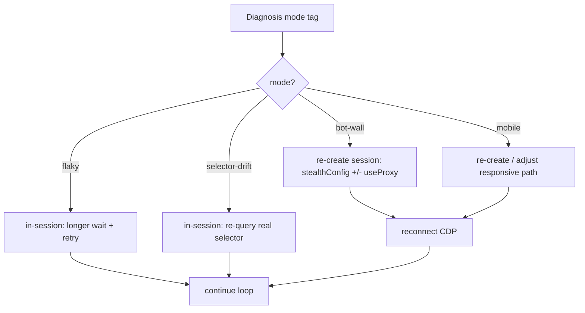

# feat: MP7 — Recover (retry + session re-create)

**Date:** 2026-06-18
**Type:** feat
**Depth:** Standard
**Origin:** `docs/brainstorms/2026-06-18-steel-reliability-arcade-requirements.md`
**Index:** `docs/plans/2026-06-18-002-feat-arcade-miniprojects-index-plan.md`
**R-IDs:** R8, R12 · **Depends on:** MP3, MP6

---

## Summary

After diagnosis (MP6), the agent recovers — and recovery has **two distinct shapes** (origin gotcha #9):
in-session adjust (modes a/b: wait longer, try the real selector) and **session re-create** (modes d/e: tear
down, create a new session with `stealthConfig` for the bot wall, `dimensions` for the mobile bug). Mirrors
Steel's `steel-reliability` skill ("fix the blocks"). The diagnosis taxonomy tag selects the strategy.

---

## Problem Frame

Not all failures recover the same way. (a)/(b) are in-session retries; (d)/(e) require a *new* session with
different create-opts — a different code path and an extra session-create mid-run (worsens the Netlify
timeout pressure, gotcha #8). And the bot-wall recovery must be **honest**: our wall (MP1 U4) gates on a
signal `stealthConfig` actually flips, or the recover is a no-op lie (gotcha #2). `useProxy` may not be
free-tier honest (gotcha #1), so it's verify-then-include-or-drop-to-verbal.

---

## Requirements

- **R8** — Recover with an adjusted strategy and continue.
- **R12** — Recover bot wall via `stealthConfig` (+ `useProxy` if free-tier-honest); recover mobile bug.

---

## Key Technical Decisions

- **KTD1 — Strategy selected by MP6 mode tag.** `flaky` → longer wait/retry; `selector-drift` → re-query
  with discovered selector; `bot-wall` → re-create session w/ `stealthConfig`; `mobile` → re-create / adjust
  for the responsive path.
- **KTD2 — Re-create is a separate path from retry** (gotcha #9). Modes d/e go through MP2 lifecycle
  create with new opts + reconnect; a/b stay in-session.
- **KTD3 — `stealthConfig` is the verified-free recover; `useProxy` is conditional** (gotcha #1). Plan the
  bot-wall beat on `stealthConfig` alone. Verify free-tier `useProxy` early; if it errors/no-ops, drop it to
  a verbal point — never let a no-op proxy stand in as a real beat.
- **KTD4 — Honest bot-wall gate** (gotcha #2). The recover only counts if MP1 U4's wall gates on a signal
  `stealthConfig` demonstrably changes. Cross-verify with MP1 U4 before claiming the beat.

## High-Level Technical Design

---

## Implementation Units

### U1. In-session recovery (modes a/b)
- **Model tier:** 🟡 Capable — bounded retry + re-query selector; built pattern in `hcaptchaStep`/`visionGridStep`.
- **Goal:** Retry flaky + selector-drift failures without a new session.
- **Requirements:** R8
- **Dependencies:** MP3 (loop), MP6 (mode tag)
- **Files:** `netlify/functions/lib/recover-insession.js`, `netlify/functions/lib/recover-insession.test.js`
- **Approach:** `flaky` → increase wait + re-attempt the action; `selector-drift` → use the selector
  discovered in observation rather than the obvious one. Bounded retries.
- **Test scenarios:**
  - Happy (a): flaky element recovered by longer wait → level continues.
  - Happy (b): selector-drift recovered by real selector → continues.
  - Error: retries exhausted → escalate to fail (feeds fleet as unrecovered).
  - `Covers: R8 in-session recover.`
- **Verification:** modes a/b reliably recover in-session on the arcade site.

### U2. Session re-create recovery (modes d/e)
- **Model tier:** 🔴 Highly-capable — `useProxy` free-tier honesty probe (gotcha #1; `relaunchWithStealth` currently hardwires it) + honest bot-wall verification (gotcha #2). Judgment + external probing, high cost-of-wrong.
- **Goal:** Recover bot-wall + mobile by creating a new session with adjusted opts.
- **Requirements:** R8, R12
- **Dependencies:** MP2 (lifecycle create/release), MP6 (mode tag), MP1 U4/U5
- **Files:** `netlify/functions/lib/recover-recreate.js`, `netlify/functions/lib/recover-recreate.test.js`
- **Approach:** `bot-wall` → release current, create new with `stealthConfig` (+`useProxy` iff verified),
  reconnect CDP, re-navigate. `mobile` → create with corrected `dimensions` / adjust responsive path.
- **Execution note:** verify the MP1 U4 wall actually passes under `stealthConfig`, and that free-tier
  `useProxy` works, BEFORE promising either on stage (gotchas #1, #2).
- **Test scenarios:**
  - Happy (d): bot-wall → stealth re-create → access-denied gone → continues.
  - Happy (e): mobile bug → corrected viewport re-create → path resolves.
  - Error: `useProxy` errors on free tier → fall back to `stealthConfig` alone, beat still real.
  - Error: re-create mid-run exceeds timeout window → FE handles, no zombie session.
  - Integration: full diagnose(bot-wall)→release→stealth-create→reconnect→win.
- **Verification:** d/e recover via a genuinely different (stealth-passing) session; no no-op proxy claim.

---

## Open Questions

- **Does Hobby/free tier allow `useProxy`?** (gotcha #1) — verify before promising; default to
  `stealthConfig`-only beat.
- What signal does MP1 U4's bot wall gate on so a stealthed relaunch legitimately passes? (gotcha #2) —
  resolved jointly with MP1 U4.
- Re-create mid-run vs Netlify timeout (gotcha #8) — FE-drives-loop (MP3 KTD1) absorbs the extra create.

## Scope Boundaries

**In:** in-session retry + session re-create recovery, mode-tag-driven.
**Out:** diagnosis itself (MP6); fleet aggregation of recovered/failed (MP8). Real proxy claims if unverified.
