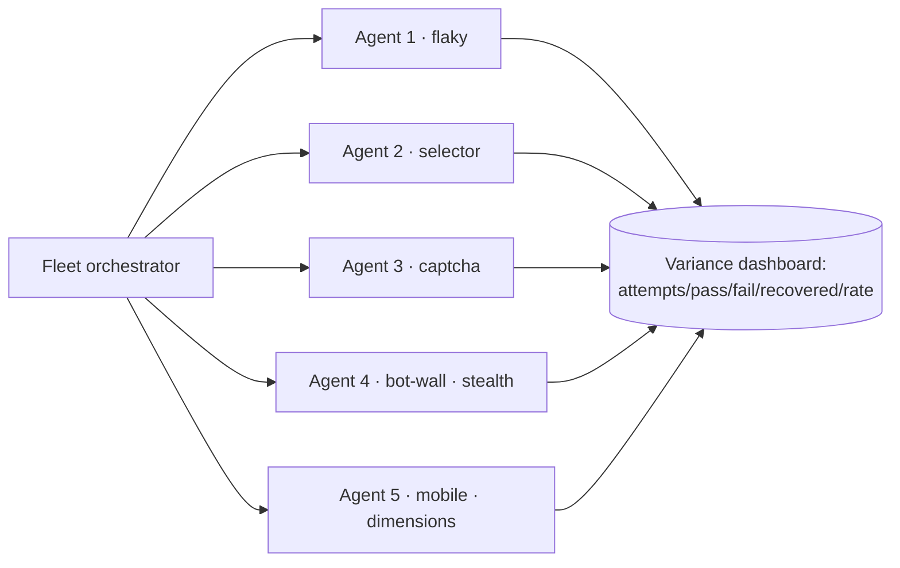

# feat: MP8 — Parallel Fleet + Variance Dashboard

**Date:** 2026-06-18
**Type:** feat
**Depth:** Standard
**Origin:** `docs/brainstorms/2026-06-18-steel-reliability-arcade-requirements.md`
**Index:** `docs/plans/2026-06-18-002-feat-arcade-miniprojects-index-plan.md`
**R-IDs:** R9 · **Depends on:** MP5, MP6, MP7

---

## Summary

The finale: run **N agents concurrently**, each hitting a **different route / failure mode** (not the same
one N times), feeding a reliability dashboard — attempts, passes, failures, recovered, success rate. Nods to
Steel Wire's 100-concurrent-session concurrency. The variance must be **honest**: different agents hit
different failures (modes a–e across the fleet), so the dashboard shows real per-route variance, not a
staged uniform result.

---

## Problem Frame

"Embarrassingly reliable at fleet scale" is Hussien's bet. A fleet that runs the same task N times is
unconvincing; a fleet where each agent meets a different failure and the dashboard shows who passed /
failed / recovered demonstrates honest reliability under variance. Constraint: Steel Hobby concurrency cap
(~5) + 100 browser-hour budget across rehearsals (gotcha #4) bounds fleet size.

---

## Requirements

- **R9** — N concurrent sessions, each a different route/failure, into a variance dashboard
  (attempts / passes / failures / recovered / success rate).

---

## Key Technical Decisions

- **KTD1 — Fleet size bounded by concurrency cap + budget** (gotcha #4). Default **3–5** agents; each
  distinct create-config (baseline / stealth / mobile) is a separate session counting against the ~5 cap.
  Confirm final size against rehearsal browser-hour burn.
- **KTD2 — Each agent gets a distinct route/mode** so variance is honest (modes a–e distributed across the
  fleet, reusing MP1's query-param knobs to force a specific mode per agent).
- **KTD3 — Aggregate diagnose+recover outcomes** from MP6/MP7 per agent into the dashboard
  (passed / failed / recovered-after-diagnose).

## High-Level Technical Design

---

## Implementation Units

### U1. Fleet orchestrator
- **Model tier:** 🟡 Capable — built (`fleet-run.js`); hardening is fleet-size sizing vs concurrency cap + browser-hour budget (gotcha #4), a bounded decision.
- **Goal:** Launch N agents concurrently, each assigned a distinct mode/config.
- **Requirements:** R9
- **Dependencies:** MP3 (loop), MP5/MP6/MP7 (per-agent route+diagnose+recover), MP2 (create configs)
- **Files:** `netlify/functions/fleet.js`, `public/arcade/fleet.js`, `netlify/functions/lib/fleet.test.js`
- **Approach:** FE fans out N step-loops (reusing MP3's FE-drives model) with per-agent goal + forced mode
  knob + create-config. Respect concurrency cap; stagger creates if needed.
- **Execution note:** budget browser-hours across rehearsal runs; cap N at the Hobby concurrency limit.
- **Test scenarios:**
  - Happy: N agents run concurrently, each on its assigned mode.
  - Edge: exceeding concurrency cap → queue/stagger, no create errors.
  - Error: one agent crashes → others continue; dashboard marks it failed.
  - Integration: a 3-agent fleet across distinct modes produces mixed real outcomes.
  - `Covers: R9.`
- **Verification:** fleet runs end-to-end with honest per-agent variance.

### U2. Variance dashboard
- **Model tier:** 🟢 Less-capable — render per-agent status grid + aggregate rate from a known payload shape.
- **Goal:** Live dashboard of attempts / passes / failures / recovered / success rate.
- **Requirements:** R9
- **Dependencies:** U1
- **Files:** `public/arcade/dashboard.js`, `public/arcade/index.html`, `public/arcade/dashboard.test.js`
- **Approach:** Subscribe to per-agent status (running/passed/failed/recovered + mode); render a live grid +
  aggregate success rate. Distinguish "recovered" (failed then recovered) from clean pass — that's the
  reliability story.
- **Test scenarios:**
  - Happy: each agent's terminal state lands in the right column; rate computes.
  - Edge: recovered-after-failure counts distinctly from clean pass.
  - Edge: all-fail and all-pass extremes render correctly.
  - `Covers: R9 dashboard.`
- **Verification:** dashboard matches actual per-agent outcomes on a live fleet run.

---

## Open Questions

- Fleet size 3 vs 5 vs concurrency cap (~5) + browser-hour budget (gotcha #4) — confirm in rehearsal.
- Gemini free-tier rate limits under a parallel fleet — confirm headroom; throttle/stagger if needed.

## Scope Boundaries

**In:** concurrent fleet orchestration + honest variance dashboard.
**Out:** per-agent diagnose/recover internals (MP6/MP7); Steel Wire-scale 100 sessions (verbal nod only).
